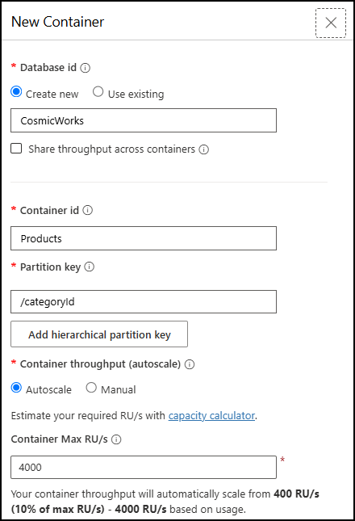
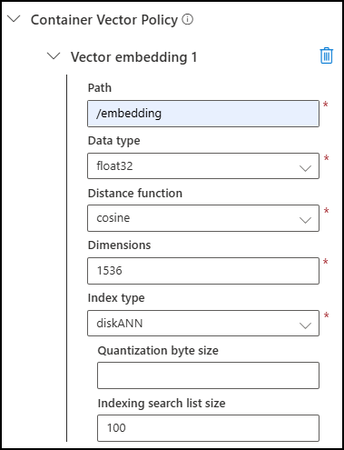

# Enable Vector Search for Azure Cosmos DB for NoSQL

Azure Cosmos DB for NoSQL provides an efficient vector indexing and search capability designed to store and query high-dimensional vectors efficiently and accurately at any scale. To take advantage of this capability, you must enable your account to use the *Vector Search for NoSQL API* feature.

In this lab, you will create an Azure Cosmos DB for NoSQL account and enable the Vector Search feature on it in order to prepare a database for use as a vector store.

## Prepare your development environment

If you have not already cloned the lab code repository for **Build copilots with Azure Cosmos DB** to the environment where you're working on this lab, follow these steps to do so. Otherwise, open the previously cloned folder in **Visual Studio Code**.

1. Launch **Visual Studio Code**.

    > &#128221; If you are not already familiar with the Visual Studio Code interface, review the [Get Started guide for Visual Studio Code](https://code.visualstudio.com/docs/getstarted/getting-started)

2. Open the command palette and run **Git: Clone** to clone the ``https://github.com/solliancenet/microsoft-learning-path-build-copilots-with-cosmos-db-labs`` GitHub repository in a local folder of your choice.

    > &#128161; You can use the **CTRL+SHIFT+P** keyboard shortcut to open the command palette.

3. Once the repository has been cloned, open the local folder you selected in **Visual Studio Code**.

## Create an Azure Cosmos DB for NoSQL account

If you already created an Azure Cosmos DB for NoSQL account for the **Build copilots with Azure Cosmos DB** labs on this site, you can use it for this lab and skip ahead to the [next section](#enable-vector-search-for-nosql-api). Otherwise, follow the steps below to create a new Azure Cosmos DB for NoSQL account.

<details markdown=1>
<summary markdown="span"><strong>Click to expand/collapse steps to create an Azure Cosmos DB for NoSQL account</strong></summary>

Azure Cosmos DB is a cloud-based NoSQL database service that supports multiple APIs. When provisioning an Azure Cosmos DB account for the first time, you will select which of the APIs you want the account to support. Once the Azure Cosmos DB for NoSQL account is done provisioning, you can retrieve the endpoint and key and use them to connect to the Azure Cosmos DB for NoSQL account using the Azure SDK for Python or any other SDK of your choice.

1. In a new web browser window or tab, navigate to the Azure portal (``portal.azure.com``).

2. Sign into the portal using the Microsoft credentials associated with your subscription.

3. Select **Create a resource**, search for *Cosmos DB*, and then create a new **Azure Cosmos DB for NoSQL** account resource with the following settings, leaving all remaining settings to their default values:

    | Setting | Value |
    | ------- | ----- |
    | **Subscription** | *Your existing Azure subscription* |
    | **Resource group** | *Select an existing or create a new resource group* |
    | **Account Name** | *Enter a globally unique name* |
    | **Location** | *Choose any available region* |
    | **Capacity mode** | *Serverless* |
    | **Apply Free Tier Discount** | *Do Not Apply* |

    > &#128221; Your lab environments may have restrictions preventing you from creating a new resource group. If that is the case, use the existing pre-created resource group.

4. Wait for the deployment task to complete before continuing with the next task.

</details>

## Enable Vector Search for NoSQL API

In this task, you will enable the *Vector Search for NoSQL API* feature in your Azure Cosmos DB account using the Azure CLI.

1. From the toolbar in the [Azure portal](https://portal.azure.com), open a Cloud Shell.

    

2. At the Cloud Shell prompt, ensure your exercise subscription is used for subsequent commands by running `az account set -s <SUBSCRIPTION_ID>`, replacing the `<SUBSCRIPTION_ID>` placeholder token with the id of the subscription you are using for this exercise.

3. Enable the *Vector Search for NoSQL API* feature by executing the following command from the Azure Cloud Shell, replacing the `<RESOURCE_GROUP_NAME>` and `<COSMOS_DB_ACCOUNT_NAME>` tokens with the name of your resource group and Azure Cosmos DB account name, respectively.

      ```azurecli
      az cosmosdb update \
        --resource-group <RESOURCE_GROUP_NAME> \
        --name <COSMOS_DB_ACCOUNT_NAME> \
        --capabilities EnableNoSQLVectorSearch
      ```

4. Wait for the command to run successfully before exiting the Cloud Shell.

5. Close the Cloud Shell.

## Create a database and container for hosting vectors

1. Select **Data Explorer** from the left-hand menu of your Azure Cosmos DB account in the [Azure portal](https://portal.azure.com), then select **New Container**.

2. In the **New Container** dialog:
   1. Under **Database id**, select **Create new** and enter "CosmicWorks" into the database id field.
   2. In the **Container id** box, enter the name "Products."
   3. Assign "/category_id" as the **Partition key.**

      

   4. Scroll to the bottom of the **New Container** dialog, expand **Container Vector Policy**, and select **Add vector embedding**.

   5. In the **Container Vector Policy** settings section, set the following:

      | Setting | Value |
      | ------- | ----- |
      | **Path** | Enter */embedding*. |
      | **Data type** | Select *float32*. |
      | **Distance function** | Select *cosine*. |
      | **Dimensions** | Enter *1536* to match the number of dimensions produced by OpenAI's `text-embedding-3-small` model. |
      | **Index type** | Select *diskANN*. |
      | **Quantization byte size** | Leave this blank. |
      | **Indexing search list size** | Accept the default value of *100*. |

      

   6. Select **OK** to create the database and container.

## Provide your user identity the Cosmos DB Built-in Data Contributor RBAC role

As the final task in this exercise, you will grant your Microsoft Entra ID user identity access to manage data in your Azure Cosmos DB for NoSQL account by assigning it to the **Cosmos DB Built-in Data Contributor** RBAC role. This will allow you use Azure authentication to access the database from Python code, and avoid needing to store and manage keys.

> &#128221; Utilizing Microsoft Entra ID's Role-Based Access Control (RBAC) for authenticating against Azure services like Azure Cosmos DB presents several primary benefits over key-based methods. Entra ID RBAC enhances security through precise access controls tailored to user roles, effectively reducing unauthorized access risks. It also streamlines user management, enabling administrators to dynamically assign and modify permissions without the hassle of distributing and maintaining cryptographic keys. Furthermore, this approach enhances compliance and auditability by aligning with organizational policies and facilitating comprehensive access monitoring and review. By streamlining secure access management, Entra ID RBAC makes a more efficient and scalable solution for leveraging Azure services.

1. From the toolbar in the [Azure portal](https://portal.azure.com), open a new Cloud Shell.

2. As you did previously, ensure your exercise subscription is used for the following commands by running `az account set -s <SUBSCRIPTION_ID>`, replacing the `<SUBSCRIPTION_ID>` placeholder token with the id of the subscription you are using for this exercise.

3. Before assigning your account to the **Cosmos DB Built-in Data Contributor** RBAC role, you must retrieve your Entra ID user identity object ID using the Azure CLI. Execute the following command a the Cloud Shell prompt, replacing the `<USER_PRINCIPAL_NAME>` with your user principal name (e.g., an email address like `user@domain.com`).

    ```azurecli
    az ad user show --id <USER_PRINCIPAL_NAME> --query id --output tsv
    ```

    The above command returns object ID associated with your user identity.

4. Copy the output of the above command for use as the `<PRINCIPAL_OBJECT_ID>` token in the `az cosmosdb sql role assignment create` command below.

5. Next, you will retrieve the definition id of the **Cosmos DB Built-in Data Contributor** role. Run the following command, ensuring you replace the `<RESOURCE_GROUP_NAME>` and `<COSMOS_DB_ACCOUNT_NAME>` tokens.

    ```azurecli
    az cosmosdb sql role definition list --resource-group "<RESOURCE_GROUP_NAME>" --account-name "<COSMOS_DB_ACCOUNT_NAME>"
    ```

    Review the output and locate the role definition named **Cosmos DB Built-in Data Contributor**. The output contains the unique identifier of the role definition in the `name` property. Record this value as it is required to use in the assignment step later in the next step.

6. You are now ready to assign yourself to the **Cosmos DB Built-in Data Contributor** role definition. Enter the following command at the prompt, making sure to replace the `<RESOURCE_GROUP_NAME>`, `<COSMOS_DB_ACCOUNT_NAME>`, and `<PRINCIPAL_OBJECT_ID>` tokens.

    > &#128221; In the command below, the `role-definition-id` is set to `00000000-0000-0000-0000-000000000002`, which is the default value for the **Cosmos DB Built-in Data Contributor** role definition. If the value you retrieved from the `az cosmosdb sql role definition list` command differs, replace the value in the command below before execution.

    ```azurecli
    az cosmosdb sql role assignment create --resource-group "<RESOURCE_GROUP_NAME>" --account-name "<COSMOS_DB_ACCOUNT_NAME>" --role-definition-id "00000000-0000-0000-0000-000000000002" --principal-id "<PRINCIPAL_OBJECT_ID>" --scope "/"
    ```

7. When the command finishes running, you will be able to run code locally to insert interact with data stored into the your Cosmos DB NoSQL database.

8. Close the Cloud Shell.
