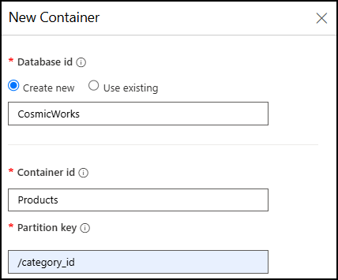

# Enable Vector Search for Azure Cosmos DB for NoSQL

Azure Cosmos DB for NoSQL provides an efficient vector indexing and search capability designed to store and query high-dimensional vectors efficiently and accurately at any scale. To take advantage of this capability, you must enable your account to use the *Vector Search for NoSQL API* feature.

In this lab, you will create an Azure Cosmos DB for NoSQL account and enable the Vector Search feature on it in order to prepare a database for use as a vector store.

## Prepare your development environment

If you have not already cloned the lab code repository for **Build copilots with Azure Cosmos DB** to the environment where you're working on this lab, follow these steps to do so. Otherwise, open the previously cloned folder in **Visual Studio Code**.

1. Launch **Visual Studio Code**.

    > &#128221; If you are not already familiar with the Visual Studio Code interface, review the [Get Started guide for Visual Studio Code][code.visualstudio.com/docs/getstarted]

2. Open the command palette and run **Git: Clone** to clone the ``https://github.com/solliancenet/microsoft-learning-path-build-copilots-with-cosmos-db-labs`` GitHub repository in a local folder of your choice.

    > &#128161; You can use the **CTRL+SHIFT+P** keyboard shortcut to open the command palette.

3. Once the repository has been cloned, open the local folder you selected in **Visual Studio Code**.

## Create an Azure Cosmos DB for NoSQL account

Azure Cosmos DB is a cloud-based NoSQL database service that supports multiple APIs. When provisioning an Azure Cosmos DB account for the first time, you will select which of the APIs you want the account to support (for example, **Mongo API** or **NoSQL API**). Once the Azure Cosmos DB for NoSQL account is done provisioning, you can retrieve the endpoint and key and use them to connect to the Azure Cosmos DB for NoSQL account using the Azure SDK for Python or any other SDK of your choice.

1. In a new web browser window or tab, navigate to the Azure portal (``portal.azure.com``).

2. Sign into the portal using the Microsoft credentials associated with your subscription.

3. Select **Create a resource**, search for *Cosmos DB*, and then create a new **Azure Cosmos DB for NoSQL** account resource with the following settings, leaving all remaining settings to their default values:

    | Setting | Value |
    | ------- | ----- |
    | **Subscription** | *Your existing Azure subscription* |
    | **Resource group** | *Select an existing or create a new resource group* |
    | **Account Name** | *Enter a globally unique name* |
    | **Location** | *Choose any available region* |
    | **Capacity mode** | *Provisioned throughput* |
    | **Apply Free Tier Discount** | *Do Not Apply* |
    | **Limit the total amount of throughput that can be provisioned on this account** | *Unchecked* |

    > &#128221; Your lab environments may have restrictions preventing you from creating a new resource group. If that is the case, use the existing pre-created resource group.

4. Wait for the deployment task to complete before continuing with the next task.

## Enable Vector Search for NoSQL API

In this task, you will enable the *Vector Search for NoSQL API* feature in your Azure Cosmos DB account using the Azure CLI.

1. Using the open Cloud Shell from the previous task, enable the *Vector Search for NoSQL API* feature by executing the following command from the Azure Cloud Shell, replacing the `<RESOURCE_GROUP_NAME>` and `<COSMOS_DB_ACCOUNT_NAME>` tokens with the name of your resource group and Azure Cosmos DB account name, respectively.

      ```azurecli
      az cosmosdb update \
        --resource-group <RESOURCE_GROUP_NAME> \
        --name <COSMOS_DB_ACCOUNT_NAME> \
        --capabilities EnableNoSQLVectorSearch
      ```

2. Wait for the command to run successfully before exiting the Cloud Shell.

3. Close the Cloud Shell.

## Create a database and container for hosting vectors

1. Select **Data Explorer** from the left-hand menu of your Azure Cosmos DB account in the [Azure portal](https://portal.azure.com), then select **New Container**.

2. In the **New Container** dialog:
   1. Under **Database id**, select **Create new** and enter "CosmicWorks" into the database id field.
   2. In the **Container id** box, enter the name "Products."
   3. Assign "/categoryId" as the **Partition key.**
   4. Ensure the **Container throughput** is set to **Autoscale** with a max RU/s of 4000.

      

   5. Scroll to the bottom of the **New Container** dialog, expand **Container Vector Policy**, and select **Add vector embedding**.

   6. In the **Container Vector Policy** settings section, set the following:

      | Setting | Value |
      | ------- | ----- |
      | **Path** | Enter */embedding*. |
      | **Data type** | Select *float32*. |
      | **Distance function** | Select *cosine*. |
      | **Dimensions** | Enter *1536* to match the number of dimensions produced by OpenAI's `text-embedding-3-small` model. |
      | **Index type** | Select *diskANN*. |
      | **Quantization byte size** | Leave this blank. |
      | **Indexing search list size** | Enter *100*. |

      

   7. Select **OK** to create the database and container.
