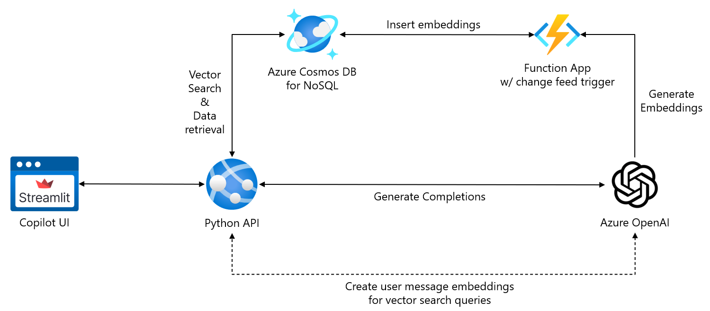

# Build a copilot with Python and Azure Cosmos DB for NoSQL

By utilizing Python's versatile programming capabilities and Azure Cosmos DB's scalable NoSQL database and vector search capabilities, you can create powerful and efficient AI copilots, streamlining complex workflows.

In this lab, you will build a copilot using Python and Azure Cosmos DB for NoSQL, creating a backend API that will provide endpoints necessary for interacting with Azure services (Azure OpenAI and Azure Cosmos DB) and a frontend UI to facilitate user interaction with the copilot. The copilot will serve as an assistant for helping Cosmic Works users manage and find bicycle-related products. Specifically, the copilot will enable users to apply and remove discounts from categories of products, look up product categories to help inform users of what product types are available, and use vector search to perform similarity searches for products.



Separating app functionality into a dedicated UI and backend API when creating a copilot in Python offers several benefits. Firstly, it enhances modularity and maintainability, allowing you to update the UI or backend independently without disrupting the other. Streamlit provides an intuitive and interactive interface that simplifies user interactions, while FastAPI ensures high-performance, asynchronous request handling and data processing. This separation also promotes scalability, as different components can be deployed across multiple servers, optimizing resource usage. Additionally, it enables better security practices, as the backend API can handle sensitive data and authentication separately, reducing the risk of exposing vulnerabilities in the UI layer. This approach leads to a more robust, efficient, and user-friendly application.

> &#128721; If you still need to complete the previous two exercises in this module, please finish them before continuing, as they provide the necessary infrastructure and starter code for this lab.

## Construct a backend API

The backend API for the copilot enriches its abilities to handle intricate data, provide real-time insights, and connect seamlessly with diverse services, making interactions more dynamic and informative. To build the API for your copilot, you will use the FastAPI Python library. FastAPI is a modern, high-performance web framework designed to enable you to build APIs with Python based on standard Python type hints. By decoupling the copilot from the backend using this approach, you ensure greater flexibility, maintainability, and scalability, allowing the copilot to evolve independently from backend changes.

> &#128721; The backend API builds upon the code you added to the `main.py` file in the `python/07-build-copilot/api/app` folder in the previous exercise. If you have not yet finished the previous exercise, please complete it before continuing.

1. In the **Explorer** pane within Visual Studio Code, browse to the **python/07-build-copilot/api/app** folder and open the `main.py` file found within it.

2. Add the following lines of code below the existing `import` statements at the top of the `main.py` file:

    ```python
    from fastapi import FastAPI
    import json
    ```

3. To enable the `/chat` endpoint you will create to receive data in the request body, you will pass content in via a `CompletionRequest` object defined in the projects *models* module. Update the `from models import Product` import statement at the top of the file to include the `CompletionRequest` class from the `models` module. The import statement should now look like this:

    ```python
    from models import Product, CompletionRequest
    ```

4. You will need the deployment name of the chat completion model you created in your Azure OpenAI Service. Create a variable at the bottom of the Azure OpenAI configuration variable block to provide this:

    ```python
    COMPLETION_DEPLOYMENT_NAME = 'gpt-4o'
    ```

5. Create an instance of the FastAPI class using the following code, which should be inserted below the Azure Cosmos DB configuration variable block near the top of the `main.py` file:

    ```python
    app = FastAPI()
    ```

    By calling `FastAPI()`, you are initializing a new instance of the FastAPI application. This instance, referred to as `app`, will serve as the main entry point for your web application.

6. Next, stub out the endpoints for your API. The `api_status` method is attached to the root URL of your API and acts as a status message to show that the API is up and running correctly. You will build out the `/chat` endpoint later in this exercise. Insert the following code below the code for creating the Cosmos DB client, database and container:

    ```python
    @app.get("/")
    def api_status():
        """Display a status message for the API"""
        return {"status": "ready"}
    
    @app.post('/chat')
    def generate_chat_completion(request: CompletionRequest):
        """Generate a chat completion using the Azure OpenAI API."""
        raise NotImplementedError("The chat endpoint is not implemented yet.")
    ```

7. Overwrite the main guard block at the bottom of the file to start the `uvicorn` ASGI (Asynchronous Server Gateway Interface) web server when the file is run from the command line:

    ```python
    if __name__ == "__main__":
        import uvicorn
        uvicorn.run(app, host="0.0.0.0", port=8000)
    ```

8. Save the `main.py` file. It should now look like the following, including the `generate_embeddings` and `upsert_product` methods you added in the pervious exercise:

    ```python
    from openai import AzureOpenAI
    from azure.identity import DefaultAzureCredential, get_bearer_token_provider
    from azure.cosmos import CosmosClient
    from models import Product, CompletionRequest
    from fastapi import FastAPI
    import json
    
    # Azure OpenAI configuration
    AZURE_OPENAI_ENDPOINT = "<AZURE_OPENAI_ENDPOINT>"
    AZURE_OPENAI_API_VERSION = "2024-10-21"
    EMBEDDING_DEPLOYMENT_NAME = "text-embedding-3-small"
    COMPLETION_DEPLOYMENT_NAME = 'gpt-4o'
    
    # Azure Cosmos DB configuration
    AZURE_COSMOSDB_ENDPOINT = "<AZURE_COSMOSDB_ENDPOINT>"
    DATABASE_NAME = "CosmicWorks"
    CONTAINER_NAME = "Products"
    
    app = FastAPI()
    
    # Enable Microsoft Entra ID RBAC authentication
    credential = DefaultAzureCredential()
    token_provider = get_bearer_token_provider(
        credential,
        "https://cognitiveservices.azure.com/.default"
    )
    
    # Create Azure OpenAI client
    aoai_client = AzureOpenAI(
        api_version = AZURE_OPENAI_API_VERSION,
        azure_endpoint = AZURE_OPENAI_ENDPOINT,
        azure_ad_token_provider = token_provider
    )
    
    # Create a Cosmos DB client
    cosmos_client = CosmosClient(url=AZURE_COSMOSDB_ENDPOINT, credential=credential)
    # Load the CosmicWorks database
    database = cosmos_client.get_database_client(DATABASE_NAME)
    # Retrieve the product container
    container = database.get_container_client(CONTAINER_NAME)
    
    @app.get("/")
    def api_status():
        return {"status": "ready"}
    
    @app.post('/chat')
    def generate_chat_completion(request: CompletionRequest):
        """ Generate a chat completion using the Azure OpenAI API."""
        raise NotImplementedError("The chat endpoint is not implemented yet.")
    
    def generate_embeddings(text: str):
        response = aoai_client.embeddings.create(
            input = text,
            model = EMBEDDING_DEPLOYMENT_NAME
        )
        return response.data[0].embedding
    
    def upsert_product(product: Product):
        # Upsert the product
        container.upsert_item(product)
    
    if __name__ == "__main__":
        import uvicorn
        uvicorn.run(app, host="0.0.0.0", port=8000)
    ```

9. To quickly test your API, open a new integrated terminal window in Visual Studio Code.

10. Ensure you are logged into Azure using the `az login` command. Running the following at the terminal prompt:

    ```azurecli
    az login
    ```

11. Complete the login process in your browser.

12. Change directories to `python/07-build-copilot` at the terminal prompt.

13. Ensure the integrated terminal window runs within your Python virtual environment by activating it using a command from the table below and selecting the appropriate command for your OS and shell.

    | Platform | Shell | Command to activate virtual environment |
    | -------- | ----- | --------------------------------------- |
    | POSIX | bash/zsh | `source .venv/bin/activate` |
    | | fish | `source .venv/bin/activate.fish` |
    | | csh/tcsh | `source .venv/bin/activate.csh` |
    | | pwsh | `.venv/bin/Activate.ps1` |
    | Windows | cmd.exe | `.venv\Scripts\activate.bat` |
    | | PowerShell | `.venv\Scripts\Activate.ps1` |

14. At the terminal prompt, change directories to `api/app`, then execute the following command to run the FastAPI web app:

    ```bash
    uvicorn main:app
    ```

15. If one does not open automatically, launch a new web browser window or tab and go to <http://127.0.0.1:8000>. 

    A message of `{"status":"ready"}` in the browser window indicates your API is running.

16. Navigate to the Swagger UI for the API by appending `/docs` to the end of the URL: <http://127.0.0.1:8000/docs>.

    > &#128221; The Swagger UI is an interactive, web-based interface for exploring and testing API endpoints generated from OpenAPI specifications. It allows developers and users to visualize, interact with, and debug real-time API calls, enhancing usability and documentation.

17. Return to Visual Studio Code and stop the API app by pressing **CTRL+C** in the associated integrated terminal window.

## Incorporate product data from Azure Cosmos DB

By leveraging data from Azure Cosmos DB, the copilot can streamline complex workflows and assist users in efficiently completing tasks. The copilot can update records and retrieve lookup values in real time, ensuring accurate and timely information. This capability enables the copilot to provide advanced interactions, enhancing users' ability to quickly and precisely navigate and complete tasks.

Functions will allow the product management copilot to apply discounts to products within a category. These functions will be the mechanism through which the copilot retrieves and interacts with Cosmic Works product data from Azure Cosmos DB.

1. The copilot will use a function named `apply_discount` to add and remove discounts and sale prices on products within a specified category. Insert the following function code below the `upsert_product` function near the bottom of the `main.py` file:

    ```python
    def apply_discount(discount: float, product_category: str) -> str:
        """Apply a discount to products in the specified category."""
        results = container.query_items(
            query = """
            SELECT * FROM Products p WHERE CONTAINS(LOWER(p.category_name), LOWER(@product_category))
            """,
            parameters = [
                {"name": "@product_category", "value": product_category}
            ],
            enable_cross_partition_query = True
        )
    
        # Apply the discount to the products
        for item in results:
            item['discount'] = discount
            item['sale_price'] = item['price'] * (1 - discount) if discount > 0 else item['price']
            container.upsert_item(item)
    
        return f"A {discount}% discount was successfully applied to {product_category}." if discount > 0 else f"Discounts on {product_category} removed successfully."
    ```

    This function performs a lookup in Azure Cosmos DB to pull all products within a category and apply the requested discount to those products. It also calculates the item's sale price using the specified discount and inserts that into the database.

2. Next, you will add a second function named `get_category_names`, which the copilot will call to assist it in knowing what product categories are available when applying or removing discounts from products. Add the below method below the `apply_discount` function in the file:

    ```python
    def get_category_names() -> list:
        """Retrieve the names of all product categories."""
        categories = container.query_items(
            query = "SELECT DISTINCT VALUE p.category_name FROM Products p",
            enable_cross_partition_query = True
        )
        return list(categories)
    ```

    The `get_category_names` function queries the `Products` container to retrieve a list of distinct category names from the database.

3. Save the `main.py` file.

## Implement the chat endpoint

The `/chat` endpoint on the backend API serves as the interface through which the frontend UI interacts with Azure OpenAI models and internal Cosmic Works product data. This endpoint acts as the communication bridge, allowing UI input to be sent to the Azure OpenAI service, which then processes these inputs using sophisticated language models. The results are then returned to the front end, enabling real-time, intelligent conversations. By leveraging this setup, developers can ensure a seamless and responsive user experience while the backend handles the complex task of processing natural language and generating appropriate responses. This approach also supports scalability and maintainability by decoupling the front end from the underlying AI infrastructure.

1. Locate the `/chat` endpoint stub you added previously in the `main.py` file.

    ```python
    @app.post('/chat')
    def generate_chat_completion(request: CompletionRequest):
        """Generate a chat completion using the Azure OpenAI API."""
        raise NotImplementedError("The chat endpoint is not implemented yet.")
    ```

    The function accepts a `CompletionRequest` as a parameter. Utilizing a class for the input parameter allows multiple properties to be passed into the API endpoint in the request body. The `CompletionRequest` class is defined within the *models* module and includes user message and chat history properties. The chat history allows the copilot to reference previous aspects of the conversation with the user, so it maintains knowledge of the context of the entire discussion.

2. To start, delete the `raise NotImplementedError("The chat endpoint is not implemented yet.")` line from the function as you are beginning the process of implementing the endpoint.

3. The first thing you will do within the chat endpoint method is provide a system prompt. This prompt defines the copilots "persona," dictacting how the copilot should interact with users, respond to questions, and leverage available functions to perform actions.

    ```python
    # Define the system prompt that contains the assistant's persona.
    system_prompt = """
    You are an intelligent copilot for Cosmic Works designed to help users manage and find bicycle-related products.
    You are helpful, friendly, and knowledgeable, but can only answer questions about Cosmic Works products.
    If asked to apply a discount:
        - Apply the specified discount to all products in the specified category. If the user did not provide you with a discount percentage and a product category, prompt them for the details you need to apply a discount.
        - Discount amounts should be specified as a decimal value (e.g., 0.1 for 10% off).
    If asked to remove discounts from a category:
        - Remove any discounts applied to products in the specified category by setting the discount value to 0.
    """
    ```

4. Next, create an array of messages to send to the LLM, adding the system prompt, any messages in the chat history, and the incoming user message. This code should go directly below the system prompt declaration in the function:

    ```python
    # Provide the copilot with a persona using the system prompt.
    messages = [{"role": "system", "content": system_prompt }]
    
    # Add the chat history to the messages list
    for message in request.chat_history:
        messages.append(message)
    
    # Add the current user message to the messages list
    messages.append({"role": "user", "content": request.message})
    ```

    The `messages` property encapsulates the ongoing conversation's history. It includes the entire sequence of user inputs and the AI's responses, which helps the model maintain context. By referencing this history, the AI can generate coherent and contextually relevant replies, ensuring that interactions remain fluid and dynamic. This property is crucial for enabling the AI to understand the flow and nuances of the conversation as it progresses.

5. To allow the copilot to use the functions you defined above for interacting with data from Azure Cosmos DB, you must define a collection of "tools." The LLM will call these tools as part of its execution. Azure OpenAI uses function definitions to enable structured interactions between the AI and various tools or APIs. When a function is defined, it describes the operations it can perform, the necessary parameters, and any required inputs. To create an array of `tools`, provide the following code containing function definitions for the `apply_discount` and `get_category_names` methods you previously defined:

    ```python
    # Define function calling tools
    tools = [
        {
            "type": "function",
            "function": {
                "name": "apply_discount",
                "description": "Apply a discount to products in the specified category",
                "parameters": {
                    "type": "object",
                    "properties": {
                        "discount": {"type": "number", "description": "The percent discount to apply."},
                        "product_category": {"type": "string", "description": "The category of products to which the discount should be applied."}
                    },
                    "required": ["discount", "product_category"]
                }
            }
        },
        {
            "type": "function",
            "function": {
                "name": "get_category_names",
                "description": "Retrieves the names of all product categories"
            }
        }
    ]
    ```

    By using function definitions, Azure OpenAI ensures that interactions between the AI and external systems are well-organized, secure, and efficient. This structured approach allows the AI to perform complex tasks seamlessly and reliably, enhancing its overall capabilities and user experience.

6. The chat endpoint will make two calls to Azure OpenAI to leverage function calling. The first provides the Azure OpenAI client access to the tools:

    ```python
    # First API call, providing the model to the defined functions
    response = aoai_client.chat.completions.create(
        model = COMPLETION_DEPLOYMENT_NAME,
        messages = messages,
        tools = tools,
        tool_choice = "auto"
    )
    
    # Process the model's response and add it to the conversation history
    response_message = response.choices[0].message
    messages.append(response_message)
    ```

7. After the first call the Azure OpenaAI, you must include code to process the function call outputs, inserting them into the conversation history so the LLM can use them to formulate a response over the data contained within those outputs:

    ```python
    # Handle function call outputs
    if response_message.tool_calls:
        for call in response_message.tool_calls:
            if call.function.name == "apply_discount":
                func_response = apply_discount(**json.loads(call.function.arguments))
                messages.append(
                    {
                        "role": "tool",
                        "tool_call_id": call.id,
                        "name": call.function.name,
                        "content": func_response
                    }
                )
            elif call.function.name == "get_category_names":
                func_response = get_category_names()
                messages.append(
                    {
                        "role": "tool",
                        "tool_call_id": call.id,
                        "name": call.function.name,
                        "content": json.dumps(func_response)
                    }
                )
    else:
        print("No function calls were made by the model.")
    ```

    Function calling in Azure OpenAI allows the seamless integration of external APIs or tools directly into your model's output. When the model detects a relevant request, it constructs a JSON object with the necessary parameters, which you then execute. The result is returned to the model, enabling it to deliver a comprehensive final response enriched with external data.

8. To complete the request with the enriched data from Azure Cosmos DB, you need to send a second request to Azure OpenAI to generate a completion:

    ```python
    # Second API call, asking the model to generate a response
    final_response = aoai_client.chat.completions.create(
        model = COMPLETION_DEPLOYMENT_NAME,
        messages = messages
    )
    ```

9. Finally, return the completion response to the UI:

    ```python
    return final_response.choices[0].message.content
    ```

10. Save the `main.py` file. The `/chat` endpoint's `generate_chat_completion` method should look like this:

    ```python
    @app.post('/chat')
    def generate_chat_completion(request: CompletionRequest):
        """Generate a chat completion using the Azure OpenAI API."""
        # Define the system prompt that contains the assistant's persona.
        system_prompt = """
        You are an intelligent copilot for Cosmic Works designed to help users manage and find bicycle-related products.
        You are helpful, friendly, and knowledgeable, but can only answer questions about Cosmic Works products.
        If asked to apply a discount:
            - Apply the specified discount to all products in the specified category. If the user did not provide you with a discount percentage and a product category, prompt them for the details you need to apply a discount.
            - Discount amounts should be specified as a decimal value (e.g., 0.1 for 10% off).
        If asked to remove discounts from a category:
            - Remove any discounts applied to products in the specified category by setting the discount value to 0.
        """
        # Provide the copilot with a persona using the system prompt.
        messages = [{ "role": "system", "content": system_prompt }]
    
        # Add the chat history to the messages list
        for message in request.chat_history:
            messages.append(message)
    
        # Add the current user message to the messages list
        messages.append({"role": "user", "content": request.message})
    
        # Define function calling tools
        tools = [
            {
                "type": "function",
                "function": {
                    "name": "apply_discount",
                    "description": "Apply a discount to products in the specified category",
                    "parameters": {
                        "type": "object",
                        "properties": {
                            "discount": {"type": "number", "description": "The percent discount to apply."},
                            "product_category": {"type": "string", "description": "The category of products to which the discount should be applied."}
                        },
                        "required": ["discount", "product_category"]
                    }
                }
            },
            {
                "type": "function",
                "function": {
                    "name": "get_category_names",
                    "description": "Retrieves the names of all product categories"
                }
            }
        ]
    
        # First API call, providing the model to the defined functions
        response = aoai_client.chat.completions.create(
            model = COMPLETION_DEPLOYMENT_NAME,
            messages = messages,
            tools = tools,
            tool_choice = "auto"
        )
    
        # Process the model's response
        response_message = response.choices[0].message
        messages.append(response_message)
    
        # Handle function call outputs
        if response_message.tool_calls:
            for call in response_message.tool_calls:
                if call.function.name == "apply_discount":
                    func_response = apply_discount(**json.loads(call.function.arguments))
                    messages.append(
                        {
                            "role": "tool",
                            "tool_call_id": call.id,
                            "name": call.function.name,
                            "content": func_response
                        }
                    )
                elif call.function.name == "get_category_names":
                    func_response = get_category_names()
                    messages.append(
                        {
                            "role": "tool",
                            "tool_call_id": call.id,
                            "name": call.function.name,
                            "content": json.dumps(func_response)
                        }
                    )
        else:
            print("No function calls were made by the model.")
    
        # Second API call, asking the model to generate a response
        final_response = aoai_client.chat.completions.create(
            model = COMPLETION_DEPLOYMENT_NAME,
            messages = messages
        )
    
        return final_response.choices[0].message.content
    ```

## Build a simple chat UI

The Streamlit UI provides a interface for users to interact with your copilot.

1. The UI will be defined using the `index.py` file located in the `python/07-build-copilot/ui` folder.

2. Open the `index.py` file and add the following import statements to the top of the file to get started:

    ```python
    import streamlit as st
    import requests
    ```

3. Configure the Streamlit page defined within the `index.py` file by adding the following line below the `import` statements:

    ```python
    st.set_page_config(page_title="Cosmic Works Copilot", layout="wide")
    ```

4. The UI will interact with the backend API by using the `requests` library to make calls to the `/chat` endpoint you defined on the API. You can encapsulate the API call in a method that expects the current user message and a list of messages from the chat history.

    ```python
    def send_message_to_copilot(message: str, chat_history: list = []) -> str:
        """Send a message to the Copilot chat endpoint."""
        try:
            api_endpoint = "http://localhost:8000"
            request = {"message": message, "chat_history": chat_history}
            response = requests.post(f"{api_endpoint}/chat", json=request, timeout=60)
            return response.json()
        except Exception as e:
            st.error(f"An error occurred: {e}")
            return""
    ```

5. Define the `main` function, which is the entry point for calls into the application.

    ```python
    def main():
        """Main function for the Cosmic Works Product Management Copilot UI."""
    
        st.write(
            """
            # Cosmic Works Product Management Copilot
        
            Welcome to Cosmic Works Product Management Copilot, a tool for managing and finding bicycle-related products in the Cosmic Works system.
        
            **Ask the copilot to apply or remove a discount on a category of products or to find products.**
            """
        )
    
        # Add a messages collection to the session state to maintain the chat history.
        if "messages" not in st.session_state:
            st.session_state.messages = []
    
        # Display message from the history on app rerun.
        for message in st.session_state.messages:
            with st.chat_message(message["role"]):
                st.markdown(message["content"])
    
        # React to user input
        if prompt := st.chat_input("What can I help you with today?"):
            with st. spinner("Awaiting the copilot's response to your message..."):
                # Display user message in chat message container
                with st.chat_message("user"):
                    st.markdown(prompt)
                
                # Send the user message to the copilot API
                response = send_message_to_copilot(prompt, st.session_state.messages)            
    
                # Display assistant response in chat message container
                with st.chat_message("assistant"):
                    st.markdown(response)
                
                # Add the current user message and assistant response messages to the chat history
                st.session_state.messages.append({"role": "user", "content": prompt})
                st.session_state.messages.append({"role": "assistant", "content": response})
    ```

6. Finally, add a **main guard** block at the end of the file:

    ```python
    if __name__ == "__main__":
        main()
    ```

7. Save the `index.py` file.

## Test the copilot via the UI

1. Return to the integrated terminal window you opened in Visual Studio Code for the API project and enter the following to start the API app:

    ```bash
    uvicorn main:app
    ```

2. Open a new integrated terminal window, change directories to `python/07-build-copilot` to activate your Python environment, then change directories to the `ui` folder and run the following to start your UI app:

    ```bash
    python -m streamlit run index.py
    ```

3. If the UI does not open automatically in a browser window, launch a new browser tab or window and navigate to <http://localhost:8501> to open the UI.

4. At the chat prompt of the UI, enter "Apply discount" and send the message.

    Because you needed to provide the copilot with more details to act, the response should be a request for more information, such as providing the discount percentage you'd like to apply and the category of products to which the discount should be applied.

5. To understand what categories are available, ask the copilot to provide you with a list of product categories.

    The copilot will make a function call using the `get_category_names` function and enrich the conversation messages with those categories so it can respond accordingly.

6. You can also ask for a more specific set of categories, such as, "Provide me with a list of clothing-related categories."

7. Next, ask the copilot to apply a 15% discount to all clothing products.

8. You can verify the pricing discount was applied by opening your Azure Cosmos DB account in the Azure portal, selecting the **Data Explorer**, and running a query against the `Products` container to view all products in the "clothing" category, such as:

    ```sql
    SELECT c.category_name, c.name, c.description, c.price, c.discount, c.sale_price FROM c
    WHERE CONTAINS(LOWER(c.category_name), "clothing")
    ```

    Observe that each item in the query results has a `discount` value of `0.15`, and the `sale_price` should be 15% less than the original `price`.

9. Return to Visual Studio Code and stop the API app by pressing **CTRL+C** in the terminal window running that app. You can leave the UI running.

## Integrate vector search

So far, you have given the copilot the ability to perform actions to apply discounts to products, but it still has no knowledge of the products stored within the database. In this task, you will add vector search capabilities that will allow you to ask for products with certain qualities and find similar products within the database.

1. Return to the `main.py` file in the `api/app` folder and provide a method for performing vector searches against the `Products` container in your Azure Cosmos DB account. You can insert this method below the existing functions near the bottom of the file.

    ```python
    def vector_search(query_embedding: list, num_results: int = 3, similarity_score: float = 0.25):
        """Search for similar product vectors in Azure Cosmos DB"""
        results = container.query_items(
            query = """
            SELECT TOP @num_results p.name, p.description, p.sku, p.price, p.discount, p.sale_price, VectorDistance(p.embedding, @query_embedding) AS similarity_score
            FROM Products p
            WHERE VectorDistance(p.embedding, @query_embedding) > @similarity_score
            ORDER BY VectorDistance(p.embedding, @query_embedding)
            """,
            parameters = [
                {"name": "@query_embedding", "value": query_embedding},
                {"name": "@num_results", "value": num_results},
                {"name": "@similarity_score", "value": similarity_score}
            ],
            enable_cross_partition_query = True
        )
        results = list(results)
        formatted_results = [{'similarity_score': result.pop('similarity_score'), 'product': result} for result in results]
        return formatted_results
    ```

2. Next, create a method named `get_similar_products` that will serve as the function used by the LLM to perform vector searches against your database:

    ```python
    def get_similar_products(message: str, num_results: int):
        """Get similar products based on the user's message"""
        # Vectorize the user message
        embedding = generate_embeddings(message)
        # Perform vector search against products in Cosmos DB
        similar_products = vector_search(embedding, num_results=num_results)
        return similar_products
    ```

    The `get_similar_products` function makes calls to the `vector_search` function you defined above, as well as the `generate_embeddings` function you created in the previous exercise. Embeddings are generated on the incoming user message to allow it to be compared to vectors stored in the database using the built-in `VectorDistance` function in Cosmos DB.

3. To allow the LLM to use the new functions, you must update the `tools` array you created earlier, adding a function definition for the `get_similar_products` method:

    ```json
    {
        "type": "function",
        "function": {
            "name": "get_similar_products",
            "description": "Get similar products based on the user's message",
            "parameters": {
                "type": "object",
                "properties": {
                    "message": {"type": "string", "description": "The user's message looking for similar products"},
                    "num_results": {"type": "integer", "description": "The number of similar products to return"}
                },
                "required": ["message"]
            }
        }
    }
    ```

4. You must also add code to handle the new function's output. Add the following `elif` condition to the code block that handles function call outputs:

    ```python
    elif call.function.name == "get_similar_products":
        func_response = get_similar_products(**json.loads(call.function.arguments))
        messages.append(
            {
                "role": "tool",
                "tool_call_id": call.id,
                "name": call.function.name,
                "content": json.dumps(func_response)
            }
        )
    ```

    The completed block with now look like this:

    ```python
    # Handle function call outputs
    if response_message.tool_calls:
        for call in response_message.tool_calls:
            if call.function.name == "apply_discount":
                func_response = apply_discount(**json.loads(call.function.arguments))
                messages.append(
                    {
                        "role": "tool",
                        "tool_call_id": call.id,
                        "name": call.function.name,
                        "content": func_response
                    }
                )
            elif call.function.name == "get_category_names":
                func_response = get_category_names()
                messages.append(
                    {
                        "role": "tool",
                        "tool_call_id": call.id,
                        "name": call.function.name,
                        "content": json.dumps(func_response)
                    }
                )
            elif call.function.name == "get_similar_products":
                func_response = get_similar_products(**json.loads(call.function.arguments))
                messages.append(
                    {
                        "role": "tool",
                        "tool_call_id": call.id,
                        "name": call.function.name,
                        "content": json.dumps(func_response)
                    }
                )
    else:
        print("No function calls were made by the model.")
    ```

5. Lastly, you need to update the system prompt definition to provide instructions on how to perform vector searches. Insert the following at the bottom of the `system_prompt`:

    ```python
    When asked to provide a list of products, you should:
        - Provide at least 3 candidate products unless the user asks for more or less, then use that number. Always include each product's name, description, price, and SKU. If the product has a discount, include it as a percentage and the associated sale price.
    ```

    The updated system prompt will be similar to:

    ```python
    system_prompt = """
    You are an intelligent copilot for Cosmic Works designed to help users manage and find bicycle-related products.
    You are helpful, friendly, and knowledgeable, but can only answer questions about Cosmic Works products.
    If asked to apply a discount:
        - Apply the specified discount to all products in the specified category. If the user did not provide you with a discount percentage and a product category, prompt them for the details you need to apply a discount.
        - Discount amounts should be specified as a decimal value (e.g., 0.1 for 10% off).
    If asked to remove discounts from a category:
        - Remove any discounts applied to products in the specified category by setting the discount value to 0.
    When asked to provide a list of products, you should:
        - Provide at least 3 candidate products unless the user asks for more or less, then use that number. Always include each product's name, description, price, and SKU. If the product has a discount, include it as a percentage and the associated sale price.
    """
    ```

6. Save the `main.py` file.

## Test the vector search feature

1. Restart the API app by running the following in the open integrated terminal window for that app in Visual Studio Code:

    ```bash
    uvicorn main:app
    ```

2. The UI should still be running, but if you stopped it, return to the integrated terminal window for it and run:

    ```bash
    python -m streamlit run index.py
    ```

3. Return to the browser window running the UI, and at the chat prompt, enter the following:

    ```bash
    Tell me about the mountain bikes in stock
    ```

    This question will return a few products that match your search.

4. Try a few other searches, such as "Show me durable pedals," "Provide a list of 5 stylish jerseys," and "Give me details about all gloves suitable for warm weather riding."

    For the last two queries, observe that the products contain the 15% discount and sale price you applied previously.
